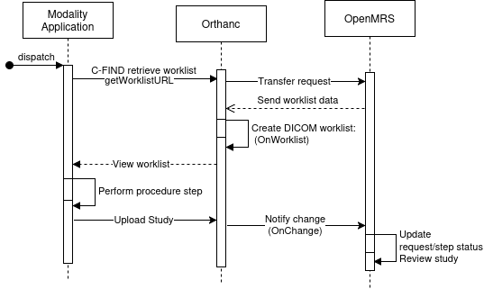
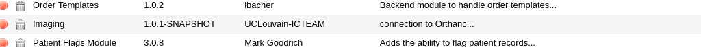
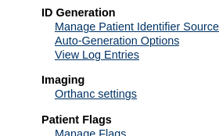

# Overview

The openmrs-esm-patient-imaging-app project contains a new frontend module for OpenMRS 3. Together with our 'imaging' backend module (see below), it provides an interface for visualizing and managing medical image data and worklists for patient imaging procedures.

The frontend provides a tabular overview of the medical image data available for a patient and of the list of issued imaging requests. Various management functions allow to users to manage medical images (upload, assign, and delete) and the imaging procedure requests (create and and delete).

The backend module provides connectivity to one or multiple Orthanc servers (https://www.orthanc-server.com/). The Orthanc servers store the DICOM imaging data uploaded by users or modalities.

The Orthanc servers also act as DICOM worklist servers. Imaging procedure requests created in the frontend can be queried by modalities or the radiology department from the Orthanc servers. When a DICOM study matching the `PerformedProcedureStepID` tag of a worklist procedure step is uploaded to an Orthanc server, the Orthanc server will notify the OpenMRS server and the status of the procedure step will change in the frontend.

Watch the video demonstration of the module here: [](https://youtu.be/no3WNaq4Q_M)

 

This diagram illustrates the workflow of the worklist. A radiologist wants to view the worklist generated in OpenMRS via C-FIND Rest API
URL. The Orthanc server forwards the request to OpenMRS. OpenMRS processes the request and returns the worklist in JSON format. The Orthanc plugin function ``Onworklsit`` reads the data and generates the worklist in DICOM format. The results can be viewed with the command like ``findscu -v -W -k "ScheduledProcedureStepSequence[0].Modality=CT" 127.0.0.1 4242``. 
When the radiologist performs the procedure, a new DICOM study is created and uploaded to the Orthanc server. The Orthanc plugin observes the new study using the OnChange function, notifies OpenMRS to update the worklist status and marks the associated procedure step as completed.

# Preparing your OpenMRS and Orthanc servers

The following is needed:
- An OpenMRS 3 frontend server
- An OpenMRS backend server
- One or multiple Orthanc servers

## Deploying the backend module

Download our imaging backend OMOD module from https://github.com/sadrezhao/openmrs-module-imaging/releases, copy it to the module directory of your OpenMRS backend server, and start the server. If deployed successfully, it should appear in the list of loaded modules on your server:



## Configure the connection to the Orthanc servers

You must provide connection settings (IP address, username, etc.) in order to allow OpenMRS to reach the Orthanc server(s). If the imaging backend module has been correctly deployed, you can access the connection settings on the administration page of your OpenMRS server:



## Configure your Orthanc servers

The imaging backend module provides an REST API service that the Orthanc servers need to contact to query and update the worklist. Add the following lines to the configuration file of the Orthanc servers (typically the file `/etc/orthanc/orthanc.json`):

```bash
    "ImagingWorklistURL": "http://OPENMRSHOST:OPENMRSPORT/openmrs/ws/rest/v1/worklist/requests",   
    "ImagingUpdateRequestStatus": "http://OPENMRSHOST:OPENMRSPORT/openmrs/ws/rest/v1/worklist/updaterequeststatus",`
    "ImagingWorklistUsername" : "OPENMRSHOSTUSER",`  
    "ImagingWorklistPassword" : "OPENMRSHOSTPASSWORD"`
```

Replace OPENMRSHOST and OPENMRSPORT by the address and port of your OpenMRS backend server, and OPENMRSHOSTUSER and OPENMRSHOSTPASSWORD by the name and password of an user account on the OpenMRS server that you have created for the Orthanc servers.

## Install the worklist plugin on the Orthanc servers:

The Orthanc servers act as worklist servers for the modalities. Our python plugin for Orthanc implements the needed functionality. Download the python script from https://github.com/sadrezhao/openmrs-module-imaging/blob/main/python/orthancWorklist.py and place it in a directory that is accessible by the Orthanc servers, for example in `/etc/orthanc`. Then add the following line to the python plugin configuration file of Orthanc (typically the file `python.json` in `/etc/orthanc`):

   `"PythonScript": "/etc/orthanc/orthancWorklist.py",`

Then restart the Orthanc server:

   `sudo systemctl restart orthanc`

# Running the frontend module

To locally run the OpenMRS frontend and backend servers, enter the openmrs-esm-patient-imaging-app project directory and execute:

```sh
yarn  # to install frontend dependencies

mvn openmrs-sdk:run -DserverId=YOUR_OPENMRS_SERVER` # to start the backend server with id YOUR_OPENMRS_SERVER

npm start -- --backend http://OPENMRSHOST:OPENMRSPORT/` # to start the front end server with OPENMRSHOST:OPENMRSPORT as backend
```

Replace YOUR_OPENMRS_SERVER, OPENMRSHOST and OPENMRSPORT by the corresponding information of your backend server.


# Testing the worklist

First, create some new imaging requests in the front end. The DCMTK findscu tool from https://support.dcmtk.org/docs/findscu.html allows to query the resulting DICOM worklists from the Orthanc server (replace 127.0.0.1 by the IP address of the Orthanc server):

```bash
findscu -v -W -k "ScheduledProcedureStepSequence[0].Modality=CT" 127.0.0.1 4242     # Query by modality 

findscu -v -W -k "PatientID=PatientUuid" 127.0.0.1 4242  # Query by patient data

findscu -v -W -k "ScheduledProcedureStepSequence[0].RequestedProcedureDescription=xxx" 127.0.0.1 4242 # Query by requested procedure description
```

If you want to generate a `.wl` file, uncomment the following lines from the python plugin:

``` bash
# This code only for test:`
  # Save the DICOM buffer to a file`
  # with open("/tmp/worklist_test.wl", 'wb') as f:
  # f.write(responseDicom)`

```